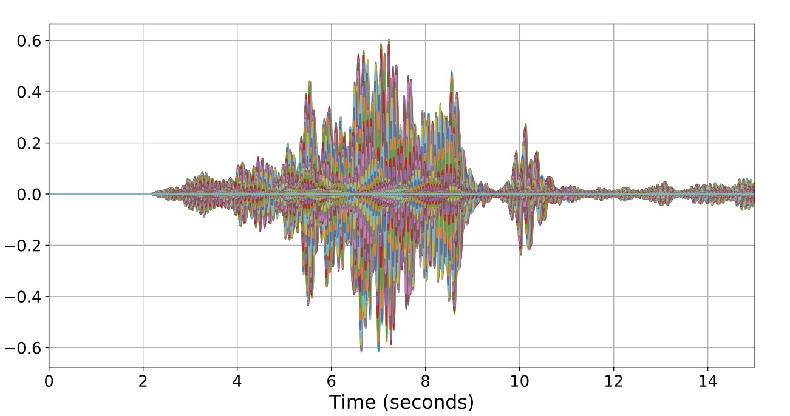
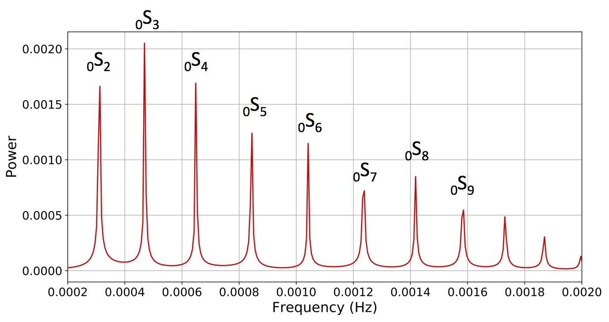
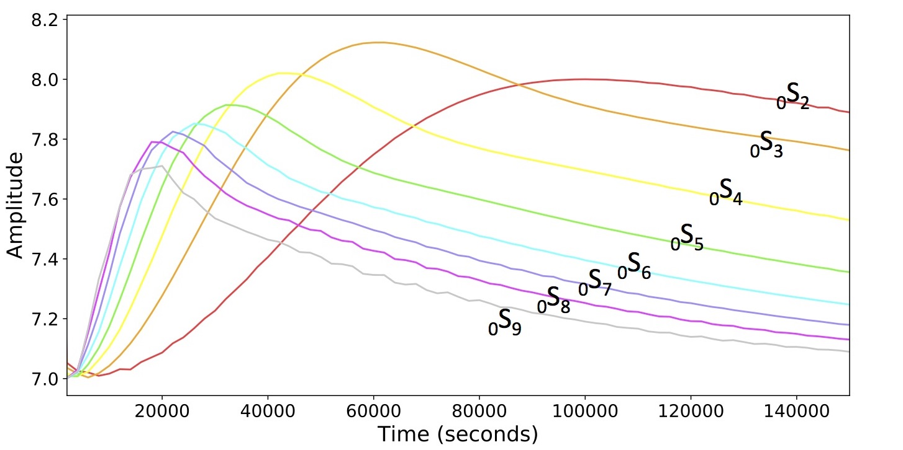

+++
# Project title.
title = "Visualizing Earth's Free Oscillations"

# Date this page was created.
date = 2018-10-30T00:00:00

# Project summary to display on homepage.
summary = "After a large earthquake, Earth's normal modes vibrate like waves on a guitar string. If the earthquake is large enough, the Earth can 'ring' for days or weeks. This video demonstrates both visually and sonically these free oscillations of the Earth."

# Tags: can be used for filtering projects.
# Example: `tags = ["machine-learning", "deep-learning"]`
tags = ["data visualization", "suface waves", "free oscillations", "normal modes"]

# Optional external URL for project (replaces project detail page).
external_link = ""

# Featured image
# To use, add an image named `featured.jpg/png` to your project's folder. 
[image]
  # Caption (optional)
  caption = ""
  
  # Focal point (optional)
  # Options: Smart, Center, TopLeft, Top, TopRight, Left, Right, BottomLeft, Bottom, BottomRight
  focal_point = "Center"
+++

This video is a contribution by [Celia Eddy](https://www.celiaeddy.com/) and I to the [Seismic Sound Lab](http://www.seismicsoundlab.org/), run by Ben Holtzman at the Lamont-Doherty Earth Observatory. 

<iframe src="https://player.vimeo.com/video/215665951" width="640" height="360" frameborder="0" webkitallowfullscreen mozallowfullscreen allowfullscreen></iframe>

After a large earthquake, Earth's normal modes vibrate like waves on a guitar string. If the earthquake is large enough, the Earth can 'ring' for days or weeks. This video demonstrates both visually and sonically these free oscillations of the Earth after the M6.9 earthquake that occurred off the coast of Fiji on 2/24/2017.

The video is composed of three separate but related animations. Each animation show how the waves travel along the surface of the earth, displayed as a circular ring. This 2-dimensional ring is made up of 2,000 points on the Earth's surface that display ground motion for 48 hours after the earthquake.

## Animation 1: Surface waves
* **AUDIO :** 
* **VIDEO :**

<figure>

<figcaption>
  
  <small>
      Fig 1. Drift patterns of the 30 OBS of the 2018 Young Pacific Orca deployment. A clockwise mesoscale gyre can be observed that correlates in space and time with geostrophic flow patterns.
  </small>
  
</figcaption>
</figure>

<figure>

<figcaption>
  
  <small>
      Fig 2. Drift patterns of the 30 OBS of the 2018 Young Pacific Orca deployment. A clockwise mesoscale gyre can be observed that correlates in space and time with geostrophic flow patterns.
  </small>
  
</figcaption>
</figure>

<figure>

<figcaption>
  
  <small>
      Fig 3. Drift patterns of the 30 OBS of the 2018 Young Pacific Orca deployment. A clockwise mesoscale gyre can be observed that correlates in space and time with geostrophic flow patterns.
  </small>
  
</figcaption>
</figure>

After a large earthquake, waves bounce around inside the earth for hours and sometimes days. These audio-visualizations show how these waves travel along the surface of the earth, displayed as a ring. This 2-dimensional ring is made up of 2,000 points on the earth's surface that display ground motion after an earthquake.

Audiovisual of the M6.9 earthquake that occurred off the coast of Fiji on 2/24/2017. 

VISUAL: Synthetic seismograms were generated at 2000 points on the earth's surface using Instaseis. Both the vertical (Z) and radial (R) components are visualized, resulting in elliptical patterns. Can you spot the Rayleigh waves? 

AUDIO: We are listening to the antipode (bottom of the circle) where our "microphone" is denoted by the red circle. The seismogram at the antipode is sonified using a new resynthesis technique that captures frequency content of the waveform more accurately than direct sonification.

Audiovisual demonstration where traveling waves are generated by the sum of many standing waves (normal modes) at the Earth's surface.

VIDEO: shows 9 of Earth's observable lowest frequency normal modes (color rings) with tones corresponding to the center frequency of each mode. Higher frequency modes are represented by cool colors and low frequencies by warm colors. The outer ring (white) represents the sum of the colored rings. Can you spot the waves traveling through the ring?

AUDIO: The loudness of each tone is modulated by its amplitude envelope. Notice how the chord evolves over time as the higher frequencies die away.
