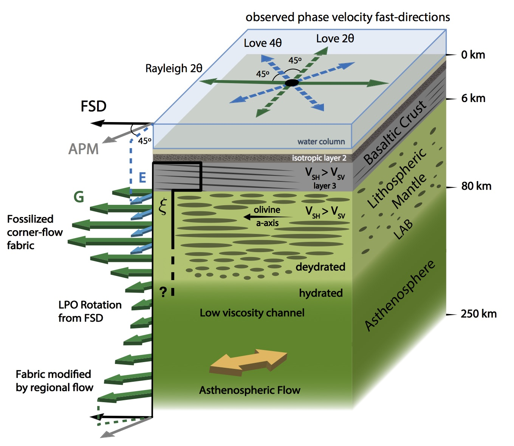

+++
# Project title.
title = "NoMelt: seismic constraints on oceanic lithosphere petrofabric"

# Date this page was created.
date = 2018-10-30T00:00:00

# Project summary to display on homepage.
summary = "The goal of this project is to comprehensively characterize the anisotropic structure of ~70 Ma oceanic lithosphere. This will help us better understand mid ocean ridge processes as well as the evolution of oceanic lithosphere."

# Tags: can be used for filtering projects.
# Example: `tags = ["machine-learning", "deep-learning"]`
tags = ["Seismic Anisotropy", "Surface Waves", "Ambient Noise"]

# Optional external URL for project (replaces project detail page).
external_link = ""

# Slides (optional).
#   Associate this project with Markdown slides.
#   Simply enter your slide deck's filename without extension.
#   E.g. `slides = "example-slides"` references 
#   `content/slides/example-slides.md`.
#   Otherwise, set `slides = ""`.
slides = ""

# Links (optional).
url_pdf = ""
url_slides = ""
url_video = ""
url_code = ""

# Custom links (optional).
#   Uncomment line below to enable. For multiple links, use the form `[{...}, {...}, {...}]`.
#url_custom = [{icon_pack = "fab", icon="twitter", name="Follow", url = "https://twitter.com/JBRussell_"}]

math = true

# Featured image
# To use, add an image named `featured.jpg/png` to your project's folder. 
[image]
  # Caption (optional)
  caption = "Russell et al. (2018)"
  
  # Focal point (optional)
  # Options: Smart, Center, TopLeft, Top, TopRight, Left, Right, BottomLeft, Bottom, BottomRight
  focal_point = "Center"
  
  # Show image only in page previews?
  preview_only = true
+++

  

  
 Seismic anisotropy offers perhaps the most direct observational window into convection in Earth's mantle as well as the structure and formation of oceanic plates. The NoMelt experiment, located ~1000 km southeast of Hawaii, was designed to better understand the fundamental plate tectonic processes involved in the formation and evolution of oceanic plates by looking at a region far from complications due to upwelling or subduction. 

I use surface waves from ambient seismic noise recorded on ocean bottom seismometers (OBS) at NoMelt to measure both azimuthal and polarization anisotropy. For the first time, we are able to observe the complete anisotropic complexity of surface waves, including Love wave anisotropy. This allows us to completely characterize the elastic structure of the oceanic lithosphere and compare it with handsample petrofabrics.

---

## Comparing to Petrofabrics

By measuring the complete set of anisotropic parameters for both Rayleigh and Love waves, we can for the first time compare the seismically derived elastic behavior of oceanic lithosphere with that directly measured from lithospheric rocks. We find excellent agreement in the anisotropic terms (see below) suggesting that we have truly bridged the gap between surface-wave and handsample length scales.


