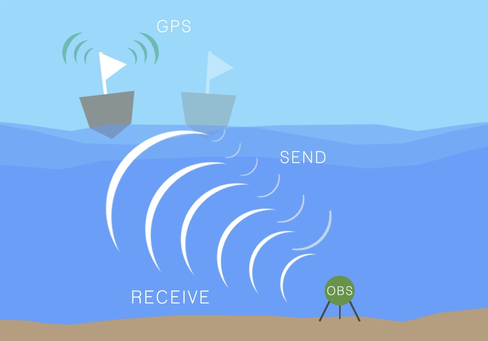

+++
# Project title.
title = "OBSrange: A new tool for the precise location of ocean bottom seismometers"

# Date this page was created.
date = 2018-10-30T00:00:00

# Project summary to display on homepage.
summary = "We have developed a new tool called OBSrange for precisely locating ocean bottom seismometers (OBS) on the seafloor. The tool is written in both Python and MATLAB and open for use by the scientific community."

# Tags: can be used for filtering projects.
# Example: `tags = ["machine-learning", "deep-learning"]`
tags = ["OBS instrumentation", "inverse theory"]

# Optional external URL for project (replaces project detail page).
external_link = ""

# Featured image
# To use, add an image named `featured.jpg/png` to your project's folder. 
[image]
  # Caption (optional)
  caption = "Russell et al. (2018)"
  
  # Focal point (optional)
  # Options: Smart, Center, TopLeft, Top, TopRight, Left, Right, BottomLeft, Bottom, BottomRight
  focal_point = "Center"
+++

<figure>
  
<figcaption>
  
  <small>
      Fig 1. Schematic showing the rangining procedure for location ocean bottom seismometers (OBS) on the seafloor [Russell et al., 2018].
  </small>
  
</figcaption>
</figure>

Nearly all seismological analyses require accurate knowledge of the instrument location. Furthermore, successful recovery of OBS from the seafloor rely on our ability to locate them. Together with <a href="http://zeilon.squarespace.com/">Zach Eilon</a> and <a href ="https://www.researchgate.net/profile/Stephen_Mosher">Stephen Mosher</a>, I have developed a new open-source tool called <a href="">OBSrange</a> for locating ocean bottom seismometers on the seafloor and providing statistically robust uncertainties. We applied the tool to data from the 2018 Young Pacific ORCA deployment, revealing a clockwise mesoscale eddy that correlates with observed ocean currents in the region. This novel measurement of depth integrated flow through the water column is the first of its kind and could potentially be used to calibrate models of vertical shear.

<figure>

<figcaption>
  
  <small>
      Fig 2. Drift patterns of the 30 OBS of the 2018 Young Pacific Orca deployment. A clockwise mesoscale gyre is observed that correlates in space and time with geostrophic flow patterns.
  </small>
  
</figcaption>
</figure>

