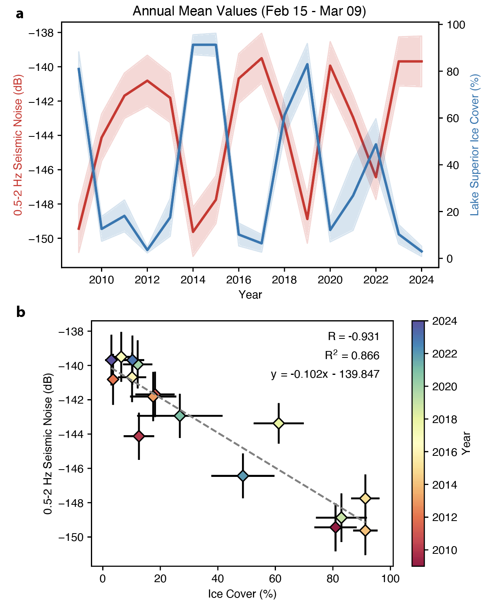
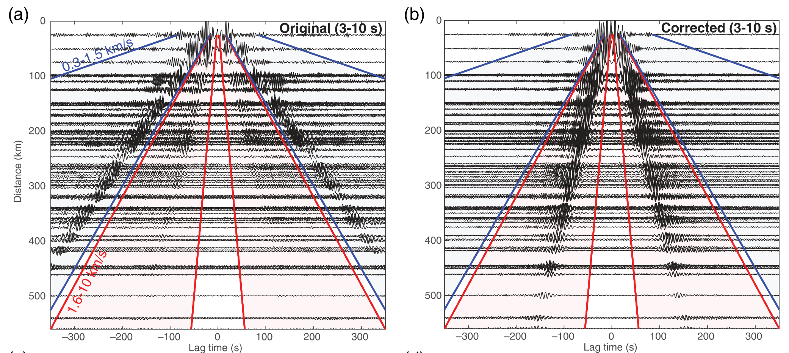

+++
# Project title.
title = "Environmental Seismology, Ambient Noise, & Ground Motion"

# Date this page was created.
date = 2018-10-28T00:00:00

# Project summary to display on homepage.
summary = "What can seismic noise reveal about how the cryosphere and hydrosphere interact with the solid Earth? How does near-surface structure impact intensity of seismic shaking?"

# Tags: can be used for filtering projects.
# Example: `tags = ["machine-learning", "deep-learning"]`
tags = ["Ambient Noise", "Seismic Attenuation", "OBS"]

# Slides (optional).
#   Associate this project with Markdown slides.
#   Simply enter your slide deck's filename without extension.
#   E.g. `slides = "example-slides"` references 
#   `content/slides/example-slides.md`.
#   Otherwise, set `slides = ""`.
slides = ""

# Links (optional).
url_pdf = ""
url_slides = ""
url_video = ""
# url_code = "https://github.com/jbrussell/mat-LRTdisp"

# Custom links (optional).
#   Uncomment line below to enable. For multiple links, use the form `[{...}, {...}, {...}]`.
# url_custom = [{icon_pack = "fab", icon="twitter", name="Follow", url = "https://twitter.com/JBRussell_"}]

# Optional external URL for project (replaces project detail page).
external_link = ""

# Featured image
# To use, add an image named `featured.jpg/png` to your project's folder. 
[image]
  # Caption (optional)
  caption = "Russell et al. (2018)"
  
  # Focal point (optional)
  # Options: Smart, Center, TopLeft, Top, TopRight, Left, Right, BottomLeft, Bottom, BottomRight
  focal_point = "Center"
  
  # Show image only in page previews?
  preview_only = true
+++

---

\
\

## **Environmental Seismology** 

  

    How can seismology tell us about environmental processes? Seismometers measure vibrations occuring at Earth's surface due to people, cars, earthquakes, ocean waves, and a range of other environmental phoenomena. Therefore, seismology can be used as an effective tool for understanding interactions between the solid Earth, cryosphere, hydrosphere, and atmosphere. Many of the tools we develop for imaging the Earth's deep interior using seismic noise can be shifted to higher frequency and repurposed for studying near-surface and environmental problems. We work on problems such as the effect of lake ice on seismic noise and using seismic observations to estimate ice cover.
  

  <figure style="margin: 0; text-align: center; flex-shrink: 0;">
    
    <figcaption style="margin-top:8px; font-size:14px; color:#555; max-width:350px; white-space:normal;">
      Figure showing correlation between seismic noise and lake ice cover on Lake Superior.
    </figcaption>
  </figure>

Related publications:

- [**J.B. Russell**, Carchedi, C. Estimating Ice Cover on the Great Lakes using Seismic Noise. (in prep)](prep)

-  [J.M. Maurer, J.M. Schaefer, **J.B. Russell**, S. Rupper, N. Wangdi, A. Putnam, N. Young (2020). Seismic observations, numerical modeling, and geomorphic analysis of a glacier lake outburst flood in the Himalayas. Science Advances.](https://advances.sciencemag.org/content/6/38/eaba3645)

\
\

---

\
\

## **Seismic Ambient Noise**

  

    Seismic ambient noise has revolutionized seismology in recent decades by providing short period (high frequency) information about structure of the crust and shallow lithosphere. We are working on refining existing ambient noise imaging techniques, improving data quality through corrections, and extending it for new purposes. One application of ambient noise that has severely lagged is seismic attenuation. Due to the pre-conditioning that many studies apply to the raw data, amplitudes are often not reliable. We are actively working on new methods of extracting robust attenuation parameters from the crust using ambient noise.
  

<figure style="margin: 0; text-align: left; flex-shrink: 0;">
  
    <figcaption style="margin-top:8px; font-size:14px; color:#555; max-width:1000px; white-space:normal;">
      Figure 1 from Janiszewski & Russell (2025) showing ambient noise cross-correlations and enhancement of overtone Rayleigh waves in the ocean.
    </figcaption>
  </figure>

Related publications:

- [**J.B. Russell**, J.B. Gaherty (2021). Lithosphere structure and seismic anisotropy offshore eastern North America: Implications for continental breakup and ultra-slow spreading dynamics. Journal of Geophysical Research.](https://doi.org/10.1029/2021JB022955)

- [H.A. Janisewski, **J.B. Russell** (2025). Ambient Noise Analyses at Broadband Ocean Bottom Seismometers: Data Quality and Transfer Function Corrections. Seismological Research Letters](https://doi.org/10.1785/0220250106)

- [H.A. Janiszewski, Z.C. Eilon, **J.B. Russell**, B. Brunsvik, J.B. Gaherty, S.G. Mosher, W.B. Hawley, S. Coats (2023). Broad-band ocean bottom seismometer noise properties. Geophysical Journal International.](https://doi.org/10.1093/gji/ggac450)

\
\
\

---
