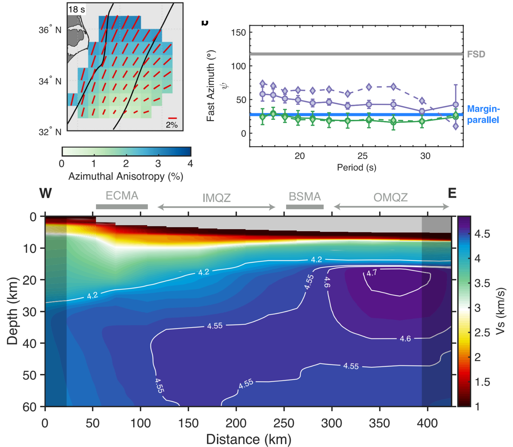
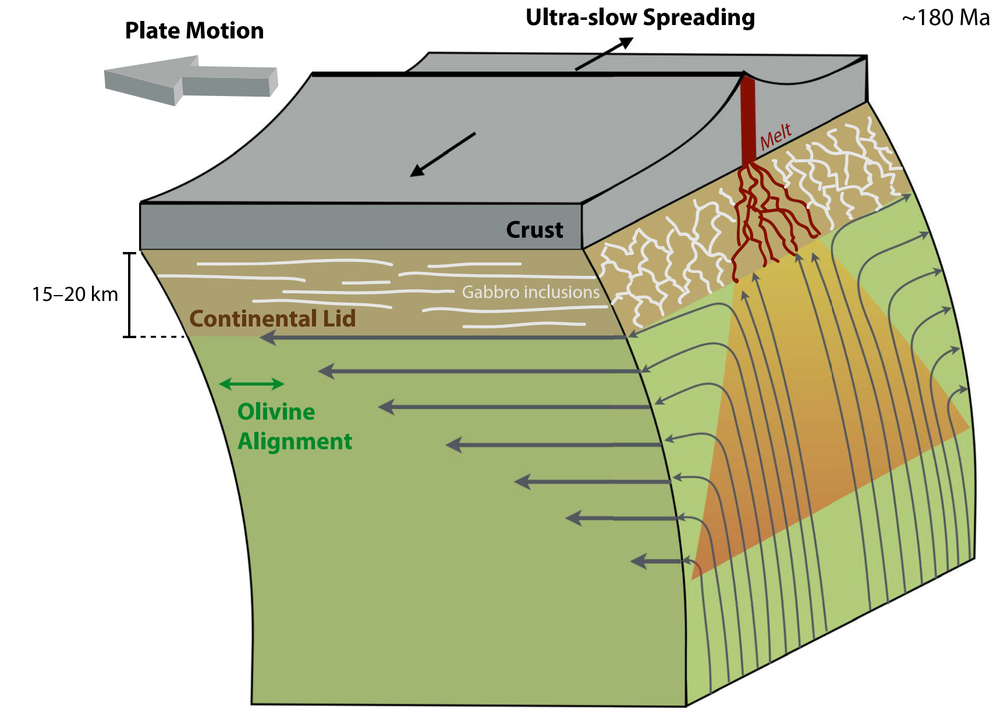

+++
# Project title.
title = "Continental Breakup & Mid-Ocean Ridge Dynamics"

# Date this page was created.
date = 2023-02-16T00:00:00

# Project summary to display on homepage.
summary = "How does rifting transition to seafloor spreading? Why and how do continents split apart? What processes control mid-ocean ridge dynamics?"

# Tags: can be used for filtering projects.
# Example: `tags = ["machine-learning", "deep-learning"]`
tags = ["Seismic Anisotropy", "3D Imaging", "Ambient Noise", "OBS"]

# Optional external URL for project (replaces project detail page).
external_link = ""

# Slides (optional).
#   Associate this project with Markdown slides.
#   Simply enter your slide deck's filename without extension.
#   E.g. `slides = "example-slides"` references 
#   `content/slides/example-slides.md`.
#   Otherwise, set `slides = ""`.
slides = ""

# Links (optional).
url_pdf = ""
url_slides = ""
url_video = ""
url_code = ""

# Custom links (optional).
#   Uncomment line below to enable. For multiple links, use the form `[{...}, {...}, {...}]`.
#url_custom = [{icon_pack = "fab", icon="twitter", name="Follow", url = "https://twitter.com/JBRussell_"}]

math = true

# Featured image
# To use, add an image named `featured.jpg/png` to your project's folder. 
[image]
  # Caption (optional)
  caption = "Russell et al. (2020)"
  
  # Focal point (optional)
  # Options: Smart, Center, TopLeft, Top, TopRight, Left, Right, BottomLeft, Bottom, BottomRight
  focal_point = "Center"
  
  # Show image only in page previews?
  preview_only = true
+++

---

\
\

## **Rift-to-Drift** 

  

    Continental breakup leads to the formation of spreading centers, which are the factories that generate new oceanic lithosphere, are key contributors to the release of heat and volatiles from the planet’s interior, and are drivers of plate tectonics. Yet, questions remain regarding the fundamental rift-to-drift process, modes of mantle deformation in extensional settings, crustal accretion processes, and extent and degree of melting. Oceanic lithosphere provides a window into mid-ocean ridge processes via structures preserved within it.
  

  <figure style="margin: 0; text-align: center; flex-shrink: 0;">
    
    <figcaption style="margin-top:8px; font-size:14px; color:#555; max-width:350px; white-space:normal;">
      Figures from Russell & Gaherty (2021) showing upper mantle structure at seismic anisotropy at the ENAM-CSU experiment.
    </figcaption>
  </figure>

  <figure style="margin: 0; text-align: center; flex-shrink: 0;">
    
    <figcaption style="margin-top:8px; font-size:14px; color:#555; max-width:350px; white-space:normal;">
      Interpretation from Russell & Gaherty (2021) demonstrating how mantle flow may be modified by the overriding plate motion.
    </figcaption>
  </figure>
  

    A key outstanding question pertaining to the rift-to-drift process is how the asthenosphere (re)organizes during the transition from the late stages of rifting to early stages of seafloor spreading. We can learn a lot from investigating passive margins, the remnants of lithosphere left over from continental breakup and successful rifting. For example, at the Eastern North American Margin Community Seismic Experiment (ENAM-CSE) we found anisotropy that is oriented parallel to the margine (perpendicular to what is epected) indicating that mantle flow during the earliest stages of seafloor spreading is not what we previously thought.
  

Related publications:

- [**J.B. Russell**, J.B. Gaherty (2021). Lithosphere structure and seismic anisotropy offshore eastern North America: Implications for continental breakup and ultra-slow spreading dynamics. Journal of Geophysical Research.](https://doi.org/10.1029/2021JB022955)

- [N.J. Accardo, J.B. Gaherty, D.J. Shillington, E.Hopper, A.A. Nyblade, C.J. Ebinger, C.A. Scholz, P.R.N. Chindandali, R. Wambura-Ferdinand, G. Mbogoni, **J.B. Russell**, B.K. Holtzman, C. Havlin, C. Class (2020). Thermo‐chemical modification of the Upper Mantle beneath the Northern Malawi Rift Constrained from Shear Velocity Imaging. Geochemistry, Geophysics, Geosystems.](https://agupubs.onlinelibrary.wiley.com/doi/abs/10.1029/2019GC008843)

\
\

---

\
\

## **Mid-Ocean Ridge Dynamics**

**New Project Coming Fall 2026!**



\
\
\

---