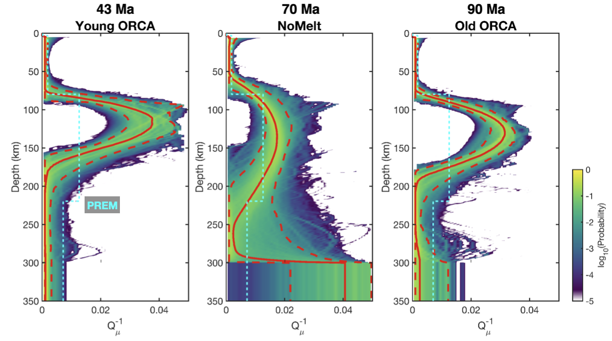
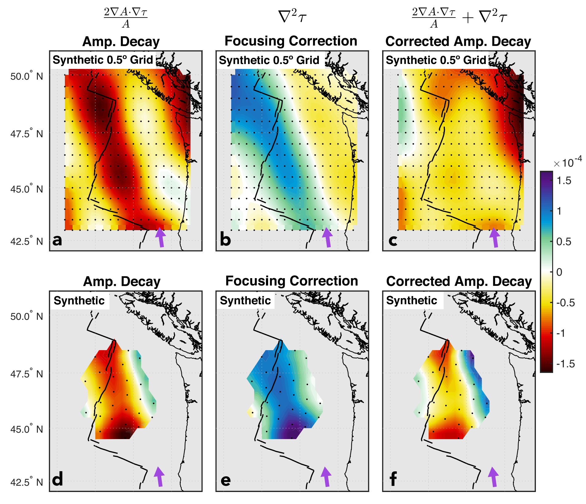
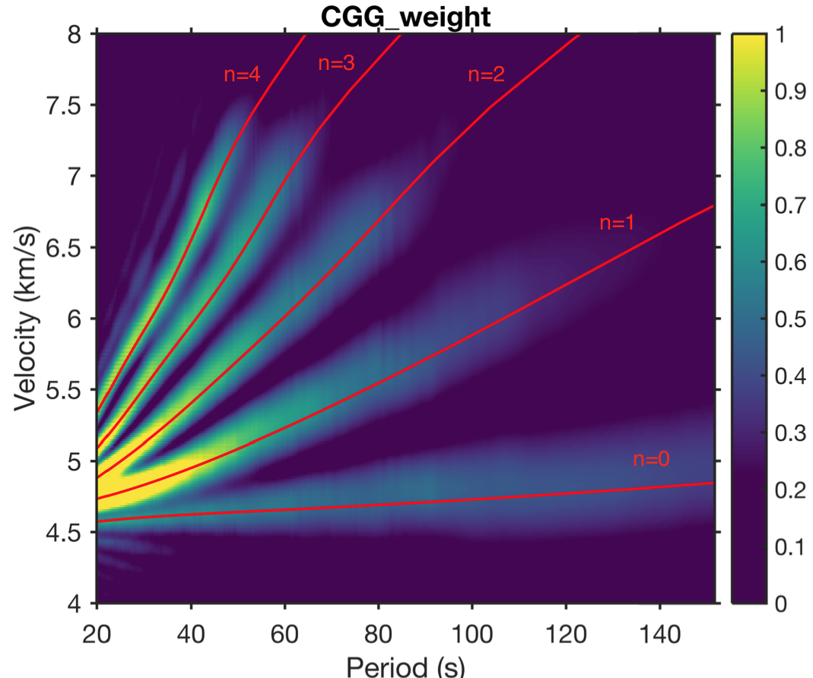
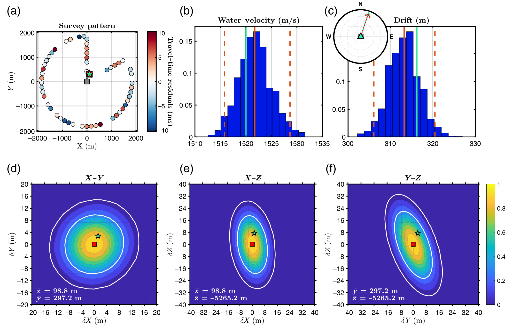

+++
# Project title.
title = "Inverse Theory, Imaging Methods, and Community Tools"

# Date this page was created.
date = 2017-10-30T00:00:00

# Project summary to display on homepage.
summary = "Development of novel methods for imaging Earth's interior, incorporating diverse geochemical, petrological, and rheological datasets."

# Tags: can be used for filtering projects.
# Example: `tags = ["machine-learning", "deep-learning"]`
tags = ["Seismic Anisotropy", "Seismic Attenuation", "Ambient Noise", "3D Imaging", "OBS"]

# Optional external URL for project (replaces project detail page).
external_link = ""

# Slides (optional).
#   Associate this project with Markdown slides.
#   Simply enter your slide deck's filename without extension.
#   E.g. `slides = "example-slides"` references 
#   `content/slides/example-slides.md`.
#   Otherwise, set `slides = ""`.
slides = ""

# Links (optional).
url_pdf = ""
url_slides = ""
url_video = ""
url_code = ""

# Custom links (optional).
#   Uncomment line below to enable. For multiple links, use the form `[{...}, {...}, {...}]`.
# url_custom = [{icon_pack = "fab", icon="twitter", name="Follow", url = "https://twitter.com/JBRussell_"}]
# url_custom = [{name="Publication", url = "https://doi.org/10.1029/2018JB016598"}]

math = true

# Featured image
# To use, add an image named `featured.jpg/png` to your project's folder. 
[image]
  # Caption (optional)
  caption = "Russell et al. (2018)"
  
  # Focal point (optional)
  # Options: Smart, Center, TopLeft, Top, TopRight, Left, Right, BottomLeft, Bottom, BottomRight
  focal_point = "Center"
  
  # Show image only in page previews?
  preview_only = true
+++

---

\
\

## **Imaging Methods & Inverse Theory**

  

    Making new discoveries about Earth's interior requires innovating methods to probe regions deep within the Earth that are otherwise inaccessible. Our group leverages multiple seismological datatypes to better image Earth structure. 
  

  <figure style="margin: 0; text-align: center; flex-shrink: 0;">
    
    <figcaption style="margin-top:8px; font-size:14px; color:#555; max-width:300px; white-space:normal;">
      Bayesian inversion for seismic attenuation.
    </figcaption>
  </figure>

  <figure style="margin: 0; text-align: center; flex-shrink: 0;">
    
    <figcaption style="margin-top:8px; font-size:14px; color:#555; max-width:300px; white-space:normal;">
      Figure 4 from Russell & Dalton (2022) showing corrections for elastic focusing.
    </figcaption>
  </figure>
  

    Wave travel-time information is commonly used to produce models of seismic velocity, which are sensitive to temperature and composition, but an observed change in seismic velocity can be explained equally well by multiple physical mechanisms. Therefore, we leverage two additional types of wave measurements—seismic attenuation and seismic anisotropy—that are challenging to make but provide complementary constraints on temperature, viscosity, melt, grain size, volatile content, and the dynamics of the upper mantle. These parameters are crucial for understanding the scale and vigor of mantle convection and structure and evolution of the lithosphere-asthenosphere system.
  

Related publications:

- [**J.B. Russell**, C.A. Dalton (2022). Rayleigh Wave Attenuation and Amplification Measured at Ocean-Bottom Seismometer Arrays using Helmholtz Tomography. Journal of Geophysical Research.](https://doi.org/10.1029/2022JB025174)

- [**J.B. Russell**, J.B. Gaherty (2021). Lithosphere structure and seismic anisotropy offshore eastern North America: Implications for continental breakup and ultra-slow spreading dynamics. Journal of Geophysical Research.](https://doi.org/10.1029/2021JB022955)

- [W. Menke, **J.B. Russell** (2020). Non-Double-Couple Components of the Moment Tensor in a Transversely Isotropic Medium. Bulletin of the Seismological Society of America.](https://pubs.geoscienceworld.org/ssa/bssa/article-abstract/doi/10.1785/0120190319/584672/Non-Double-Couple-Components-of-the-Moment-Tensor?redirectedFrom=fulltext)

\
\

---

\
\

## **Community Tools**

  

    Development of computational tools that are open and accessible to the community is a key part of what we do in our group. As a student in my group, you will learn how to write "good code" and how to share that code on common platforms like GitHub. These are important skills to have both for science and industry.
  

  <figure style="margin: 0; text-align: center; flex-shrink: 0;">
    
    <figcaption style="margin-top:8px; font-size:14px; color:#555; max-width:350px; white-space:normal;">
      Radon transform from the mat-LRTdisp package showing phase velocity dispersion for Love wave mode branches.
    </figcaption>
  </figure>

  <figure style="margin: 0; text-align: center; flex-shrink: 0;">
    
    <figcaption style="margin-top:8px; font-size:14px; color:#555; max-width:350px; white-space:normal;">
      Figure 2 from Russell et al. (2019) demonstrating the OBSrange tool for locating seismometers on the seafloor.
    </figcaption>
  </figure>
  

    We use and publish a range of tools that accomplish important tasks including: ambient noise cross-correlations, surface wave dispersion measurements and inversion, seismic attenuation measurements, Rayleigh wave ellipticity meausrements, OBS locations, array beamforming, OBS noise removal, clock drift corrections, equilibrium phase calculations, and more.
  

Related publications:

- [**J.B. Russell**, Z. Eilon, S.G. Mosher (2019). OBSrange: A New Tool for the Precise Remote Location of Ocean-Bottom Seismometers. Seismological Research Letters.](https://doi.org/10.1785/0220180336)

- [H.A. Janiszewski, Z.C. Eilon, **J.B. Russell**, B. Brunsvik, J.B. Gaherty, S.G. Mosher, W.B. Hawley, S. Coats (2023). Broad-band ocean bottom seismometer noise properties. Geophysical Journal International.](https://doi.org/10.1093/gji/ggac450)

- [Havlin, C., Chavan, K., Holtzman, B., **J.B. Russell**, Hariharan, A., Hopper, E., et al. (2025). vbr‐calc/vbr: Release v1.2.1. Zenodo.](https://doi.org/10.5281/zenodo.14674537)

\
\
\

---
