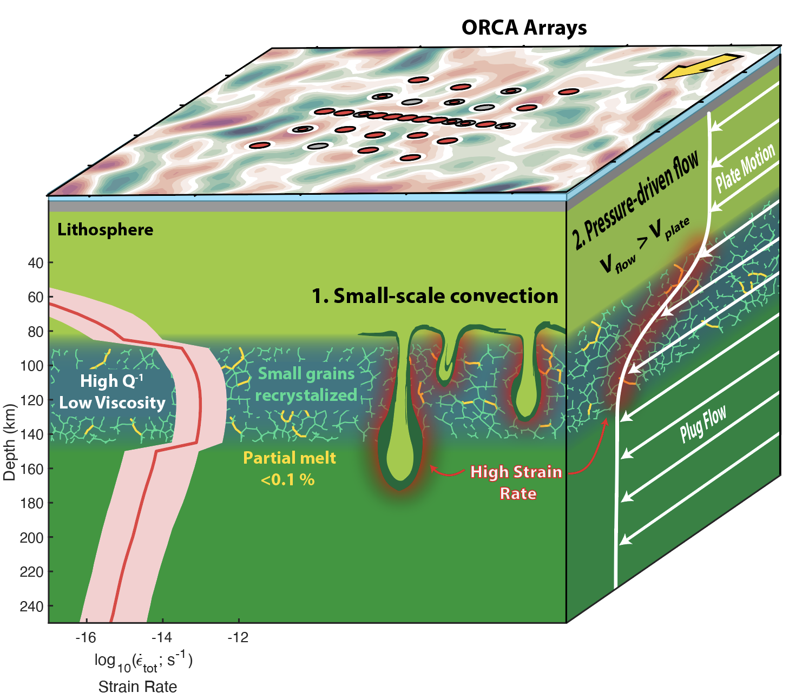
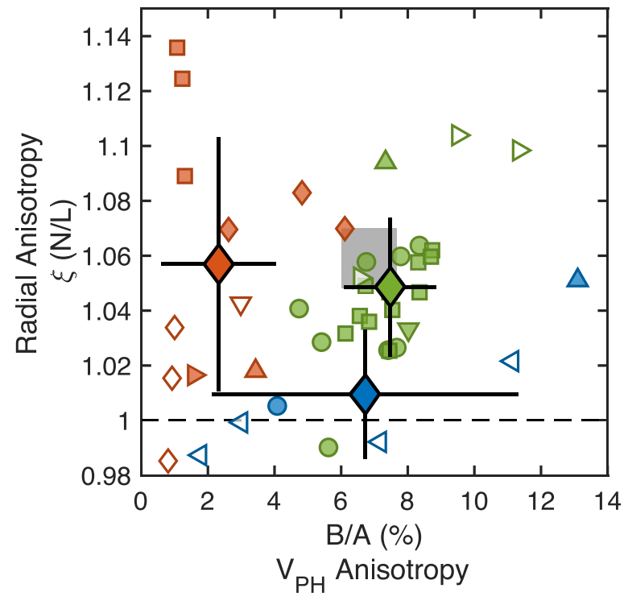

+++
# Project title.
title = "Structure & Dynamics of the Oceanic Lithosphere-Asthenosphere System"

# Date this page was created.
date = 2025-10-01T00:00:00

# Project summary to display on homepage.
summary = "How is oceanic lithosphere created and modified? Why is the oceanic asthenosphere weak? How is mantle flow recorded within the lithosphere and asthenosphere? What is the scale and vigor of convection beneath the plates?"

# Tags: can be used for filtering projects.
# Example: `tags = ["machine-learning", "deep-learning"]`
tags = ["Seismic Anisotropy", "Seismic Attenuation", "OBS", "Ambient Noise"]

# Slides (optional).
#   Associate this project with Markdown slides.
#   Simply enter your slide deck's filename without extension.
#   E.g. `slides = "example-slides"` references 
#   `content/slides/example-slides.md`.
#   Otherwise, set `slides = ""`.
slides = ""

# Links (optional).
url_pdf = ""
url_slides = ""
url_video = ""
url_code = ""

# Custom links (optional).
#   Uncomment line below to enable. For multiple links, use the form `[{...}, {...}, {...}]`.
#url_custom = [{icon_pack = "fab", icon="twitter", name="Follow", url = "https://twitter.com/JBRussell_"}]

# Optional external URL for project (replaces project detail page).
external_link = ""

# Featured image
# To use, add an image named `featured.jpg/png` to your project's folder. 
[image]
  # Caption (optional)
  caption = "Russell et al. (2018)"
  
  # Focal point (optional)
  # Options: Smart, Center, TopLeft, Top, TopRight, Left, Right, BottomLeft, Bottom, BottomRight
  focal_point = "Center"
  
  # Show image only in page previews?
  preview_only = true
  
+++



Oceanic lithosphere covers a majority of the Earth's surface, but the oceans are still largely unexplored compared to the continents. This work requires us to travel to unexplored regions of the ocean basins, placing seismometers on the seafloor to map temperature, composition, and flow in the mantle to probe plate tectonic processes at a variety of scales. 

\
\

---

\
\

## **Rheology and Flow of the Oceanic Mantle** 

  

    What dynamic processes occur in the upper mantle? To answer this fundamental question, we need to understand how mantle rocks deform and flow. As the mantle flows, the rheological and thermodynamic conditions control what kind of petrologic fabrics form. We can use seismology to infer these fabrics to learn about the dyanmic conditions that produced them. Seismic wave speeds and amplitudes change depending on the temperature, pressure, melt fraction, and volatile content of a mantle rock. Therefore, we can use these observations to constrain the mantle's physical state.
  

  <figure style="margin: 0; text-align: center; flex-shrink: 0;">
    
    <figcaption style="margin-top:8px; font-size:14px; color:#555; max-width:300px; white-space:normal;">
      Figure from Russell et al (in prep) showing an interpretation of oceanic upper mantle processes.
    </figcaption>
  </figure>

Related publications:

- [**J.B. Russell**, J.B. Gaherty, P.Y. Lin, D. Lizarralde, J.A. Collins, G. Hirth, R.L. Evans (2019). High-Resolution Constraints on Pacific Upper Mantle Petrofabric Inferred From Surface-Wave Anisotropy. Journal of Geophysical Research: Solid Earth.](https://doi.org/10.1029/2018JB016598)

- [**J.B. Russell**, J.B. Gaherty. Lithosphere structure and seismic anisotropy offshore eastern North America: Implications for continental breakup and ultra-slow spreading dynamics. Journal of Geophysical Research, 2021.](https://doi.org/10.1029/2021JB022955)

- [Dannberg, Z. Eilon, **J.B. Russell**, R. Gassmöller (2025). Understanding Sub-Lithospheric Small-Scale Convection By Linking Models of Grain Size Evolution, Mantle Convection and Seismic Tomography. Geochemistry, Geophysics, Geosystems.](https://doi.org/10.1029/2025GC012289)

- [ Z.C. Eilon, L. Zhang, J.B. Gaherty, D.W. Forsyth, **J.B. Russell** (2022). Sub-Lithospheric Small-Scale Convection Tomographically Imaged Beneath the Pacific Plate. Geophysical Research Letters.](https://doi.org/10.1029/2022GL100351)

- [Z. Ma, C.A. Dalton, **J.B. Russell**, J.B. Gaherty, G. Hirth, D.W. Forsyth (2020). Shear Attenuation and Anelastic Mechanisms in the Central Pacific Upper Mantle. Earth & Planetary Science Letters.](https://doi.org/10.1016/j.epsl.2020.116148)

\
\

---

\
\

## **Constraining Grain-Scale Mechanisms of Deformation**

\

  

    We combine seismic observations with laboratory and field data to infer grain-scale processing occuring in the upper mantle. This pushes the boundaries of traditional seismology and requires working alongside rock deformation experts. This work has allowed us to ask questions that challenge paradigms such as: Which deformation mechanism(s) are most active in the oceanic upper mantle? Is there melt in the oceanic asthenosphere? If not, what causes the oceanic asthenosphere to be week in some places and not others?
  

  <figure style="margin: 0; text-align: center; flex-shrink: 0;">
    
    <figcaption style="margin-top:8px; font-size:14px; color:#555; max-width:350px; white-space:normal;">
      Figure 5 from Russell et al. (2022) showing how in-situ observations of anisotropy at NoMelt compare to laboratory and field samples.
    </figcaption>
  </figure>

Related publications:

- [**J.B. Russell**, J.B. Gaherty, H.F. Mark, G. Hirth, L.N. Hansen, D. Lizarralde, J.A. Collins, R.L. Evans (2022). Seismological evidence for girdled olivine lattice-preferred orientation in oceanic lithosphere and implications for mantle deformation processes during seafloor spreading. Geochemistry, Geophysics, Geosystems.](https://doi.org/10.1029/2022GC010542)

- [**J.B. Russell**, C.A. Dalton, Z. Eilon, J.B. Gaherty, C. Havlin, B. Holtzman, J. Phillips, A. Hariharan, D.W. Forsyth. Seismic attenuation reveals large viscosity variations with little melt beneath Pacific plate. (in prep)](prep)

\
\
\

---
