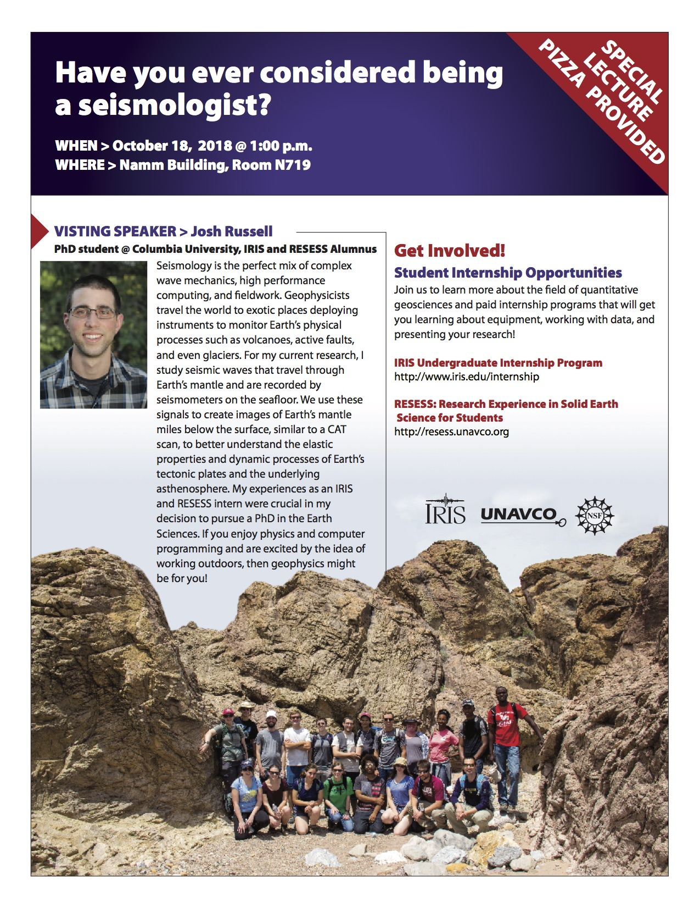

+++
title = "Pathways Into Geophysics and Seismology"
date = 2018-10-30T00:00:00  # Schedule page publish date.
draft = false

# Talk start and end times.
#   End time can optionally be hidden by prefixing the line with `#`.
time_start = 2018-10-18T13:00:00
#time_end = 2030-06-01T15:00:00

# Authors. Comma separated list, e.g. `["Bob Smith", "David Jones"]`.
authors = []

# Abstract and optional shortened version.
abstract = ""
abstract_short = "A primer on geophysics and seismology as well as research opportunities for undergraduates."

# Name of event and optional event URL.
event = "IRIS Recruitment Lecture Series"
event_url = "https://www.iris.edu/hq/internship/recruitment"

# Location of event.
location = "New York City College of Technology, Brooklyn, NY"

# Is this a selected talk? (true/false)
selected = false

# Projects (optional).
#   Associate this talk with one or more of your projects.
#   Simply enter your project's folder or file name without extension.
#   E.g. `projects = ["deep-learning"]` references 
#   `content/project/deep-learning/index.md`.
#   Otherwise, set `projects = []`.
projects = []

# Tags (optional).
#   Set `tags = []` for no tags, or use the form `tags = ["A Tag", "Another Tag"]` for one or more tags.
tags = ["outreach", "diversity"]

# Links (optional).
url_pdf = ""
url_slides = "https://jbrussell.github.io/slides/assets/player/KeynoteDHTMLPlayer.html#0"
url_video = ""
url_code = ""

# Does the content use math formatting?
math = true

# Featured image
# To use, add an image named `featured.jpg/png` to your page's folder. 
[image]
  # Caption (optional)
  caption = "Image credit: [**Unsplash**](https://unsplash.com/photos/bzdhc5b3Bxs)"

  # Focal point (optional)
  # Options: Smart, Center, TopLeft, Top, TopRight, Left, Right, BottomLeft, Bottom, BottomRight
  focal_point = "Right"
+++

In recent years, an effort has been made to broaden the geosciences both in terms of the number of underrepresented minorities as well as students with backgrounds in math, physics, and computer science. As an alumnus of the IRIS <a href="https://www.iris.edu/hq/internship/blogs/user/80">IRIS</a> and <a href="http://resess.unavco.org/people/alumni/2014/russell/russell.html">UNAVCO RESESS</a> emersive undergraduate research programs, I serve as one of the 2018 IRIS recruitment speakers as part of the <a href="https://www.iris.edu/hq/internship/recruitment">IRIS Recruitment Lecture Series</a>. In this role, I travel to minority-serving institutions to speak to undergraduates in the geosciences, mathematics, physics, and computer science about geophysics and seismology career paths as well as opportunities that are available for undergraduate research. See below for the flyer:

