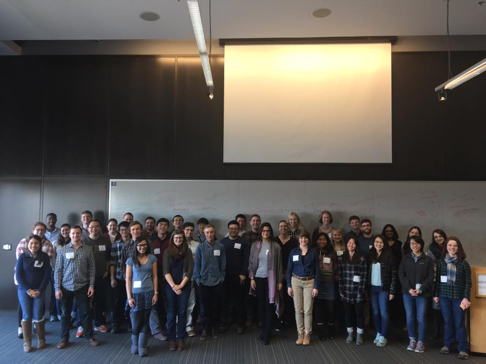

+++
title = "Constraints on radial anisotropy of ~70 Ma oceanic lithosphere"
date = 2018-10-29T00:00:00  # Schedule page publish date.
draft = false

# Talk start and end times.
#   End time can optionally be hidden by prefixing the line with `#`.
time_start = 2017-03-13T09:00:00
#time_end = 2030-06-01T15:00:00

# Authors. Comma separated list, e.g. `["Bob Smith", "David Jones"]`.
authors = []

# Abstract and optional shortened version.
abstract = ""
abstract_short = "Overview of the NoMelt experiment and using high-frequency ambient noise to constrain radial anisotropy in the shallow mantle."

# Name of event and optional event URL.
event = "Seismology Student Workshop"
event_url = "https://eesc.columbia.edu/student-life/graduate-student-life/gradsymposium/seismology-workshop"

# Location of event.
location = "Lamont-Doherty Earth Observatory, Palisades, NY"

# Is this a selected talk? (true/false)
selected = false

# Projects (optional).
#   Associate this talk with one or more of your projects.
#   Simply enter your project's folder or file name without extension.
#   E.g. `projects = ["deep-learning"]` references 
#   `content/project/deep-learning/index.md`.
#   Otherwise, set `projects = []`.
projects = []

# Tags (optional).
#   Set `tags = []` for no tags, or use the form `tags = ["A Tag", "Another Tag"]` for one or more tags.
tags = ["Seismic Anisotropy", "Oceanic Lithosphere"]

# Links (optional).
url_pdf = ""
url_slides = "https://jbrussell.github.io/slides/jrussell_SSW2017_v1.pdf"
url_video = ""
url_code = ""

# Does the content use math formatting?
math = true

# Featured image
# To use, add an image named `featured.jpg/png` to your page's folder. 
[image]
  # Caption (optional)
  caption = ""

  # Focal point (optional)
  # Options: Smart, Center, TopLeft, Top, TopRight, Left, Right, BottomLeft, Bottom, BottomRight
  focal_point = "Right"
  
  # Show image only in page previews?
  preview_only = true
+++

